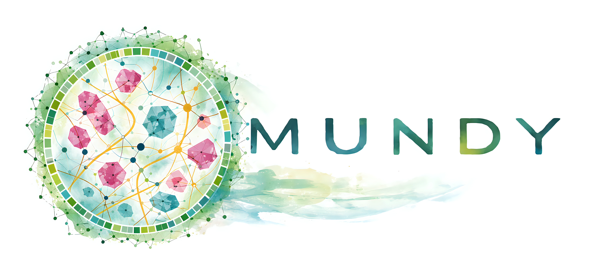

# MuNDy: Multibody Nonlocal Dynamics

MuNDy is a C++ framework for high-performance simulation of **multibody nonlocal dynamics** on modern CPU and GPU architectures.


> [!IMPORTANT]  
> **Project status (12/2/2025):** 
> MuNDy is under active development. We have chosen to make development public as we move toward a first formal release targeted for **summer 2026**.

---

## Table of Contents

- [Organizational Overview](#organizational-overview)
- [Subpackages](#subpackages)
  - [MundyUtils: Centralized reusable utilities](#mundyutils-centralized-reusable-utilities)
  - [MundyMath: Constexpr, inline mathematics](#mundymath-constexpr-inline-mathematics)
  - [MundyGeom: Geometric primitives and utilities](#mundygeom-geometric-primitives-and-utilities)
  - [MundyMech: Mechanical primitives and utilities](#mundymech-mechanical-primitives-and-utilities-under-construction)
  - [MundyMesh: MuNDy’s extension to Trilinos/STK](#mundymesh-mundys-extension-to-trilinosstk)
  - [Standalone Offshoots](#standalone-offshoots)
- [Release Roadmap](#release-roadmap)

---

## Organizational Overview

MuNDy adopts a **Trilinos-style subpackage stack**:
- Lower-level packages provide core infrastructure.
- Higher-level packages may depend on any number of layers beneath them (never the reverse).
- Users can enable only the portions they need by disabling higher-level packages during configuration.

This structure is intended to keep:
- **Core utilities** small, reusable, and dependency-light. (utils, math, geom, mech)
- **Simulation layers** configurable, so applications can opt into only what they need (mesh, mbody)

### Code Statistics (via cloc)
```text
cloc-1.96.pl --exclude-dir=TriBITS,ci,doc,scrap ./MuNDy
     322 text files.
     286 unique files.                                          
      42 files ignored.

github.com/AlDanial/cloc v 1.96  T=0.85 s (337.1 files/s, 90346.8 lines/s)
------------------------------------------------------------------
Language            files        blank        comment         code
------------------------------------------------------------------
C/C++ Header          129         6254          11607        26332
C++                    67         3755           4035        17506
CMake                  63          379           1741         1894
Markdown                4          342              0         1160
Python                  5          127            172          553
Bourne Shell           15           96             83          333
Text                    1           25              0          172
JSON                    1            5              0           67
YAML                    1            0              0            3
------------------------------------------------------------------
SUM:                  286        10983          17638        48020
------------------------------------------------------------------
```

---

## Subpackages

### MundyUtils: Centralized reusable utilities

Centralized, Kokkos-friendly building blocks for type-level plumbing, error handling, and device-aware data management.
- **`tuple` / `variant`**  
  Reduced, Kokkos-compatible analogs of `std::tuple` / `std::variant` for default-constructible types.  
  - `core::tuple` is NTTP-compatible and `constexpr`-friendly  

- **`aggregate`**  
  Compile-time extensible “tagged bag of types” (conceptually similar to `boost::hana::map`).  
  - Kokkos-compatible  
  - `constexpr` and NTTP-compatible  

- **`reference_wrapper`**  
  Kokkos-compatible analog of `std::reference_wrapper` for non-const references.  

- **`storage`**
  Unified means to maybe own or maybe view a value using a simple normalized storage policy.

- **`StringLiteral`**  
  `constexpr` string literals that are NTTP-compatible.  
  - Supports `constexpr` concatenation  

- **`MUNDY_THROW_ASSERT` / `MUNDY_THROW_REQUIRE`**  
  Kokkos-compatible throw/assert helpers with diagnostics and detailed error context 
  - On-device: abort  |  On-host: throw
  - Can be called within constexpr contexts

- **`NgpPool` / `NgpView`**  
  Dual-view abstractions that follow MuNDy’s sync semantics plus a dual-view push/pop pool.  
  - Designed to integrate cleanly with Kokkos’ NGP (Next Generation Parallelism) model  

---

### MundyMath: `constexpr`, inline mathematics

Small, composable math utilities with view semantics that integrate naturally into Kokkos-based code.
- **`Matrix` / `Vector` / `Quaternion`**  
  Kokkos-compatible, `constexpr` inline linear algebra for small matrix/vector sizes.  
  - NTTP-compatible  
  - View semantics for arbitrary accessors  

- **`minimize`**  
  Kokkos-compatible analog of dlib’s `minimize` (L-BFGS) with **no dynamic memory allocation**.  
  - Callable inside kernels or from host drivers  

- **`convex`**  
  Linear complementarity problem (LCP) and constrained convex quadratic programming (QP) solver.  
  - Kokkos-compatible  
  - Can run inside a kernel or orchestrate kernel launches
  - Supports Mixed LCP/QP problems with equality and inequality constraints

- **`Hilbert` / `zmort`**  
  Domain decomposition helpers for Hilbert space-filling curves and Z-morton ordering.  
  - Useful for load balancing and locality-aware particle/domain layout  

---

### MundyGeom: Geometric primitives and utilities

Foundational geometric abstractions for multibody dynamics and contact mechanics.
- **Primitives**  
  `Point`, `Line`, `LineSegment`, `VSegment`, `Ring`, `Sphere`, `Spherocylinder`, `SpherocylinderSegment`, `Circle3D`, `Ellipsoid`.

- **`distance`**  
  Utilities for computing:
  - Euclidean separation distances  
  - Shared-normal signed separation distances between primitives  

- **`compute_aabb` / `_bounding_radius`**  
  Helpers to compute axis-aligned bounding boxes (AABB) and bounding radii for each primitive.

- **`transform` / `randomize`**  
  Utilities for:
  - Translation  
  - Rotation  
  - Randomization of primitive configurations  

- **`periodicity`**  
  Utilities for handling distances and interactions in periodic domains.

---

### MundyMech: Mechanical primitives and utilities (under construction)

Mechanical elements and force laws for building multibody models.

- **Primitives**  
  `BallJoint`, `HookeanSpring`, `FeneSpring`, `TorsionalSpring`.

Further mechanical models and integration hooks will be added as the library matures.

---

### MundyMesh: MuNDy’s extension to Trilinos/STK

Helpers and abstractions for integrating MuNDy with Trilinos/STK meshes and fields.
- **`StringToSelector` / `StringToTopology` / `StringToRank`**  
  Map string descriptions like:
  - Selector expressions: `"(partA | partB) & !partC"`  
  - Topology: `"HEX_8"`  
  - Rank: `"ELEM_RANK"`  
  to their corresponding STK objects.

- **`DeclareEntities` / `DeclareField` / `DeclarePart`**  
  Helper functions that streamline:
  - Entity declaration  
  - Field registration  
  - Part creation  

* **`NgpModRequests`**
  A ticket-based framework for staging mesh modification requests from the device and processing them on the host.
    - Requesting new entities (with known or generated Ids)
    - Requesting new connectivity (e.g. element-to-node relations) involving existing or future entities
    - Requesting deletion of existing entities or connectivity
    - Safe and efficient in the face of concurrent requests from multiple threads on the device

- **`FieldViews`**  
  Helpers for extracting mathematical views into STK field types, both on host and device.  

- **`Aggregate`**  
  Wraps STK fields in their underlying view type, enabling clean code such as  
  ```cpp
  center_accessor(e) += dt * velocity_accessor(e);
  ```
  and aggregation of these accessors to avoid function bloat.

* **`LinkData` / `LinkCOOData` / `LinkCSRData`**
  Kokkos-compatible dynamic connectivity constructs (ghosting contrasts that are themselves entities).
  * Supports dynamically updating COO connectivity
  * Allows on-device sparse updates to CSR structures
  * Follows dual-view-like semantics aligned with STK’s NGP design

* **`NgpFieldBLAS`**
  Reimplementation of STK’s field BLAS routines with unified host/device syntax.

* **`NgpAccessorExpr`**
  MuNDy’s usability layer: a templated expression system with:

  * Automatic pruning of reused branches
  * Automatic synchronization of read fields
  * Automatic marking of modified fields as dirty

  This lets users write expressions like:

  ```cpp
  x(rods) += dt * vel(rods);
  ```

  and have them executed on the device without manual synchronization bookkeeping.

---

### Standalone Offshoots

Independent projects that emerged from MuNDy’s infrastructure and are usable on their own.
- **[OpenRAND](https://github.com/msu-sparta/OpenRAND)**
  Performance-portable, counter-based random number generation that is stupid simple to use.
  - Designed to easily fit in GPU registers
  - Makes reproducibility in spite of varied parallelism possible
  - Now used by HOOMD-Blue
  
- **[alsous_gigantism_2025](https://github.com/flatironinstitute/alsous_gigantism_2025)**
  A discrete elastic rod model implemented using MuNDy (becomes public end of December 2025). 

- **[mundy_mock_app](https://github.com/MundyRepo/mundy_mock_app)** /
  **[mundy_mock_app_tribits](https://github.com/MundyRepo/mundy_mock_app_tribits)**
  Helper applications for bootstrapping MuNDy-based codes:

  - CMake-based or TriBITS+CMake templates
  - Intended as starting points for internal and external applications that depend on MuNDy

---

## Release Roadmap

Planned steps toward the first public release (estimated summer 2026):
- [ ] Python API mirroring accessor expressions
- [ ] Flesh out the Wiki with user-facing documentation and design notes
- [ ] Polish Doxygen and public API docs
  - Implementation details should not clutter the user-facing API
- [ ] Tutorial + Example applications
---
